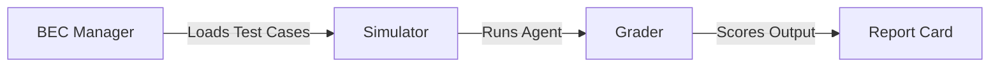

# Package Architecture

`coreason-assay` acts as the scientific testing engine for CoReason agents. It is designed around the **Run-Verify-Score Loop**, ensuring that agents are rigorously tested before deployment.

## High-Level Overview

The system ingests "Golden Data" (Test Cases), runs the agent in a simulated environment, and grades the output against expected results.

## Core Components

### 1. BEC Manager (The Data Loader)
**Module:** `coreason_assay.bec_manager`

The **Benchmark Evaluation Corpus (BEC) Manager** is responsible for ingesting and validating test data. It supports flexible input formats to accommodate different testing needs.

*   **Capabilities:**
    *   **CSV/JSONL Loading:** Bulk upload of test cases.
    *   **ZIP Archives:** Support for "Golden Files" (e.g., PDFs, CSVs) used in RAG testing.
    *   **Path Resolution:** Securely resolves relative file paths within ZIP archives to prevent traversal attacks.
    *   **Validation:** Uses Pydantic models (`TestCase`, `TestCaseInput`, `TestCaseExpectation`) to ensure data integrity.

### 2. The Simulator (The Runner)
**Module:** `coreason_assay.simulator`

The **Simulator** provides a controlled execution environment for the agents. It isolates the agent to ensure reproducible tests.

*   **Key Features:**
    *   **Mocking:** Intercepts tool calls (e.g., database queries, API calls) and returns pre-defined responses defined in the Test Case. This allows testing edge cases like "Service Unavailable" without relying on external infrastructure.
    *   **Concurrent Execution:** Runs multiple test cases in parallel using `asyncio` to minimize the total test suite duration.
    *   **Context Injection:** Injects user context (Role, Date, Time) into the agent's prompt to simulate real-world usage.

### 3. The Grader (The Scorer)
**Module:** `coreason_assay.grader`

The **Grader** evaluates the agent's performance. It goes beyond simple text matching to evaluate the *quality* and *logic* of the response.

*   **Grading Strategies:**
    *   **Deterministic:**
        *   **Schema Validation:** Checks if the output conforms to a strict JSON schema (Pydantic models).
        *   **Latency:** meaningful checks on response time.
    *   **Probabilistic (LLM-as-a-Judge):**
        *   **Faithfulness:** Verifies that the answer is derived *only* from the provided source documents.
        *   **Reasoning Alignment:** Checks if the agent followed the required logical steps (Chain-of-Thought).
        *   **Tone:** Evaluates the style of the response (e.g., "Professional", "Empathetic").

### 4. The Report Card (The Artifact)
**Module:** `coreason_assay.reporting`

The **Report Card** aggregates the results of a Test Run. It provides both high-level summaries and granular details.

*   **Outputs:**
    *   **Pass Rate:** Global percentage of passed test cases.
    *   **Drift Detection:** Compares the current run against previous runs to identify regressions (e.g., a sudden increase in latency or a drop in accuracy).
    *   **Detailed Logs:** Full execution traces and grading feedback for debugging.

## Data Models
**Module:** `coreason_assay.models`

The system relies on strong typing via Pydantic models. Key models include:

*   **`TestCase`**: Represents a single unit of work (Inputs + Expectations).
*   **`TestRun`**: Represents the execution of a Corpus against a specific Agent version.
*   **`TestResult`**: The outcome of a single Test Case, including scores and logs.
*   **`ReportCard`**: The final summary artifact.
